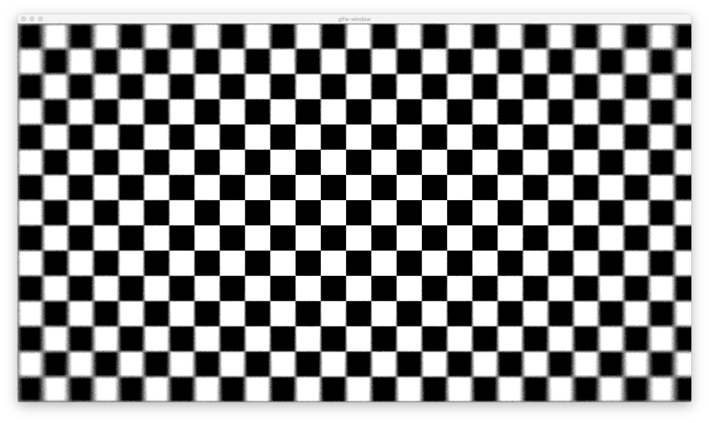

glsl-checker-blur
=================

Glisy example using
[glsl-hash-blur](https://github.com/stackgl/glsl-hash-blur) and
[glsl-checker](https://github.com/mattdesl/glsl-checker) from stack.gl



## installation

with clib:

```sh
$ clib install glisy/glsl-checker-blur
$ ./glsl-checker-blur
```

from source:

```sh
$ make
$ ./program
```

## license

mit
